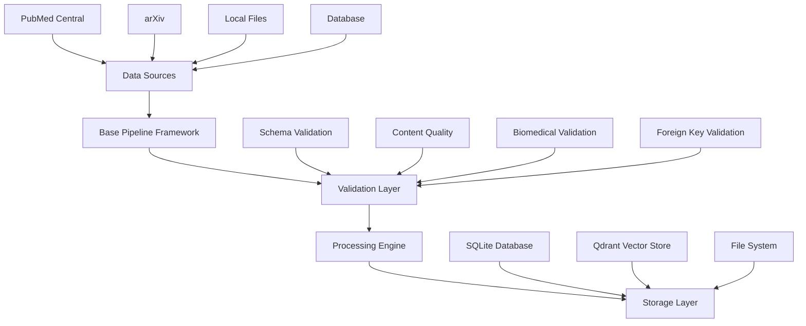

# Processing Pipelines

Robust, extensible, and multi-source data processing pipelines for biomedical literature analysis. Built on a comprehensive framework that emphasizes data validation, error handling, and replicable workflows across different data sources.

## Overview

The pipelines module implements a sophisticated processing framework that transforms raw biomedical literature into structured, searchable data with comprehensive validation at every step:

- **Multi-Source Support**: Extensible architecture for PubMed Central, arXiv, local files, and databases
- **Robust Validation**: Schema compliance, content quality, and domain-specific validation
- **Error Handling**: Comprehensive error recovery and logging throughout the pipeline
- **Data Quality Assurance**: Built-in validation for biomedical content and metadata integrity
- **Monitoring & Scheduling**: Centralized pipeline management with automated scheduling

## Pipeline Architecture



## Core Framework Components

### Base Pipeline (`base_pipeline.py`)
Abstract foundation providing:
- **Pipeline Lifecycle Management**: Standardized execution flow
- **Batch Processing**: Configurable batch sizes with progress tracking
- **Error Handling**: Comprehensive exception handling and recovery
- **Validation Integration**: Pluggable validation framework
- **Result Tracking**: Detailed execution metrics and logging

### Data Sources (`data_sources.py`)
Multi-source data access layer:
- **PubMedCentralSource**: PMC API integration with reference file management
- **ArxivSource**: arXiv API integration (extensible placeholder)
- **LocalFileSource**: Local file processing (JSON, CSV, TSV)
- **DatabaseSource**: Existing database table processing
- **Factory Pattern**: Easy source creation and configuration

### Validation Framework (`validation.py`)
Comprehensive data validation:
- **SchemaValidator**: Pydantic model compliance
- **BiomedicalContentValidator**: Domain-specific content quality
- **MetadataCompletenessValidator**: Required field validation
- **ForeignKeyValidator**: Referential integrity checking
- **DuplicateDetectionValidator**: Prevent duplicate entries
- **CompositeValidator**: Multi-validator orchestration

## Pipeline Implementations

### 1. PubMed Metadata Pipeline (`pubmed_metadata_pipeline.py`)

**Purpose**: Discovers and validates PubMed Central article metadata

**Features**:
- PMC API integration with search term configuration
- Reference file updates (file lists, ID mappings)
- Schema validation against `PMCArticleMetadata` model
- Duplicate detection and foreign key validation
- Incremental processing of new articles only

**Usage**:
```python
from BFHTW.pipelines.pubmed_metadata_pipeline import run_pubmed_metadata_pipeline

result = run_pubmed_metadata_pipeline(
    search_terms_file="search_terms.json",
    max_articles=1000,
    batch_size=100,
    strict_validation=True
)
```

### 2. Document Processing Pipeline (`document_processing_pipeline.py`)

**Purpose**: Downloads, processes, and analyzes full-text biomedical documents

**Features**:
- Multi-format support (PDF, NXML)
- Automated download and extraction from PMC FTP
- Content validation and quality assessment
- BioBERT integration for NER and embeddings
- Vector database storage with Qdrant
- Comprehensive error handling and cleanup

**Usage**:
```python
from BFHTW.pipelines.document_processing_pipeline import run_document_processing_pipeline

result = run_document_processing_pipeline(
    batch_size=5,
    enable_ai=True,
    enable_embeddings=True
)
```

## Pipeline Management (`pipeline_manager.py`)

Centralized pipeline orchestration and scheduling:

### Configuration
```yaml
pipelines:
  pubmed_metadata:
    pipeline_class: "BFHTW.pipelines.pubmed_metadata_pipeline.PubMedMetadataPipeline"
    enabled: true
    schedule_type: "daily"
    schedule_params:
      time: "02:00"
    max_runtime_minutes: 30
    parameters:
      max_articles: 1000
      batch_size: 100
    
  document_processing:
    pipeline_class: "BFHTW.pipelines.document_processing_pipeline.DocumentProcessingPipeline"
    enabled: true
    schedule_type: "hourly"
    max_runtime_minutes: 120
    parameters:
      batch_size: 5
      enable_ai_processing: true
    dependencies: ["pubmed_metadata"]
```

### Pipeline Manager Usage
```python
from BFHTW.pipelines.pipeline_manager import PipelineManager

# Initialize manager
manager = PipelineManager("pipeline_config.yaml")

# Run specific pipeline
result = manager.run_pipeline("pubmed_metadata")

# Start scheduler
manager.start_scheduler()  # Runs continuously

# Check status
status = manager.get_pipeline_status("document_processing")
```

## Data Validation Framework

### Schema Validation
```python
from BFHTW.pipelines.validation import SchemaValidator
from BFHTW.models.pubmed_pmc import PMCArticleMetadata

validator = SchemaValidator(PMCArticleMetadata, strict=True)
result = validator.validate(metadata_dict)
```

### Content Quality Validation
```python
from BFHTW.pipelines.validation import BiomedicalContentValidator

validator = BiomedicalContentValidator(
    min_text_length=100,
    require_biomedical_terms=True
)
result = validator.validate(text_content)
```

### Composite Validation
```python
from BFHTW.pipelines.validation import create_biomedical_document_validators

validators = create_biomedical_document_validators(
    model=PDFBlock,
    required_fields=['block_id', 'doc_id', 'text'],
    strict_schema=False
)
```

## Multi-Source Integration

### Adding New Data Sources

1. **Implement DataSource Interface**:
```python
from BFHTW.pipelines.base_pipeline import DataSource

class MyDataSource(DataSource):
    def get_identifier(self) -> str:
        return "my_source"
    
    def validate_connection(self) -> bool:
        # Implement connection validation
        return True
    
    def fetch_metadata(self) -> List[Dict[str, Any]]:
        # Implement data fetching
        return metadata_list
```

2. **Create Pipeline Implementation**:
```python
from BFHTW.pipelines.base_pipeline import BasePipeline

class MyDataPipeline(BasePipeline[dict, MyModel]):
    def process_item(self, item: dict) -> Optional[MyModel]:
        # Implement item processing
        return processed_item
    
    def store_item(self, item: MyModel) -> bool:
        # Implement storage logic
        return success
```

3. **Configure Pipeline**:
```yaml
pipelines:
  my_data_pipeline:
    pipeline_class: "mymodule.MyDataPipeline"
    enabled: true
    schedule_type: "daily"
    parameters:
      source_config: "config.json"
```

## Quality Assurance Features

### Validation Layers
- **Input Validation**: Source data format and completeness
- **Schema Compliance**: Pydantic model validation
- **Content Quality**: Text length, encoding, biomedical relevance
- **Referential Integrity**: Foreign key validation
- **Duplicate Detection**: Prevent data duplication

### Error Handling
- **Graceful Degradation**: Continue processing despite individual failures
- **Retry Logic**: Configurable retry attempts for transient failures
- **Comprehensive Logging**: Detailed error tracking and debugging info
- **Rollback Capability**: Transaction-safe operations where possible

### Monitoring
- **Execution Metrics**: Processing rates, success/failure counts
- **Performance Tracking**: Execution times, resource usage
- **Data Quality Metrics**: Validation scores, content quality assessment
- **Alert System**: Configurable alerts for pipeline failures

## Performance Optimizations

### Batch Processing
```python
pipeline = DocumentProcessingPipeline(
    batch_size=10,  # Process 10 articles simultaneously
    max_concurrent_downloads=5  # Limit concurrent downloads
)
```

### Resource Management
- **Memory Optimization**: Streaming processing for large datasets
- **Disk Space Management**: Automatic cleanup of temporary files
- **Connection Pooling**: Efficient database connection management
- **Rate Limiting**: Respect API limits and server constraints

### Caching Strategies
- **Metadata Caching**: Cache search results and reference data
- **Model Caching**: Reuse loaded AI models across pipeline runs
- **Incremental Processing**: Only process new/changed data

## Command Line Interface

### Direct Pipeline Execution
```bash
# Run metadata pipeline
python -m BFHTW.pipelines.pubmed_metadata_pipeline \
    --max-articles 1000 \
    --batch-size 100 \
    --strict

# Run document processing
python -m BFHTW.pipelines.document_processing_pipeline \
    --batch-size 5 \
    --no-ai \
    --max-articles 50
```

### Pipeline Manager
```bash
# Start scheduler
python -m BFHTW.pipelines.pipeline_manager start-scheduler

# Run specific pipeline
python -m BFHTW.pipelines.pipeline_manager run pubmed_metadata

# Check status
python -m BFHTW.pipelines.pipeline_manager status
```

## Integration with BFHTW Components

### Database Integration
- **Schema Alignment**: Direct mapping to database models
- **CRUD Operations**: Efficient bulk operations via utils.crud
- **Migration Support**: Automatic table creation and updates

### AI Services Integration
- **BioBERT Models**: Seamless NER and embedding generation
- **OpenAI Services**: Advanced text analysis and extraction
- **Model Versioning**: Track AI model versions in processing metadata

### Vector Database Integration
- **Qdrant Storage**: Automatic embedding storage and retrieval
- **Collection Management**: Organized by document type and model version
- **Search Integration**: Ready for semantic search queries

## Troubleshooting

### Common Issues
- **Connection Failures**: Check network connectivity and API credentials
- **Validation Errors**: Review data quality and schema compliance
- **Memory Issues**: Reduce batch sizes or enable streaming processing
- **Storage Errors**: Verify database permissions and disk space

### Debugging Tools
- **Verbose Logging**: Enable detailed logging for troubleshooting
- **Validation Reports**: Detailed validation failure analysis
- **Pipeline Metrics**: Performance and error rate monitoring
- **Test Data**: Sample datasets for pipeline testing

---

*Designed for enterprise-grade biomedical data processing with comprehensive validation, error handling, and multi-source extensibility.*

### 2. Document Processing Pipeline (`pubmed_download_and_parse.py`)

**Purpose**: Downloads, processes, and analyzes full-text articles

**Workflow**:
1. **Queue Management**: Retrieves unprocessed articles from database
2. **Content Download**: Fetches TAR.GZ archives from PMC FTP
3. **Format Detection**: Identifies PDF/NXML content types
4. **Text Extraction**: Parses documents into structured blocks
5. **AI Analysis**: Applies NER and generates embeddings
6. **Storage**: Saves results to database and vector store
7. **Cleanup**: Manages temporary files and processing state

**Key Features**:
- Multi-format support (PDF, NXML)
- Parallel processing capabilities
- Robust error handling and recovery
- Automatic figure extraction and caching
- BioBERT integration for biomedical NER
- Qdrant vector database integration

**Usage**:
```python
from BFHTW.pipelines.pubmed_download_and_parse import run_processing_pipeline

# Process next batch of articles
results = run_processing_pipeline(
    batch_size=10,
    max_concurrent=3,
    include_figures=True
)
```

## Detailed Processing Steps

### Metadata Pipeline Stages

1. **Reference File Updates**
   ```python
   # Download latest PMC reference data
   file_list = FileListFetcher().fetch_new_articles()
   id_mapping = PMCIDMappingFetcher().fetch()
   ```

2. **Search Term Processing** 
   ```python
   # Configure hepatoblastoma-specific search
   search_terms = {
       "hepatoblastoma": ["hepatoblastoma", "liver cancer pediatric"],
       "treatments": ["cisplatin", "doxorubicin", "liver transplant"],
       "resistance": ["refractory", "drug resistance"]
   }
   ```

3. **Article Discovery**
   ```python
   # Execute PMC API searches
   xml_fetch = FetchXML()
   article_paths = xml_fetch.match_pmcids_to_ftp_paths()
   ```

4. **Database Integration**
   ```python
   # Store metadata for processing
   CRUD.bulk_insert(
       table='pubmed_fulltext_links',
       model=PMCArticleMetadata,
       data_list=article_metadata
   )
   ```

### Document Processing Stages

1. **Download Management**
   ```python
   # Parallel download with error handling
   fetcher = TarballFetcher()
   tarball_path = fetcher.download(full_url, target_path)
   extracted_path = fetcher.extract(tarball_path)
   ```

2. **Content Parsing**
   ```python
   # Multi-format document parsing
   if pdf_path:
       pdf_meta = PDFReadMeta().extract_metadata(pdf_path)
       blocks = PDFBlockExtractor().extract_blocks(pdf_path)
   elif nxml_path:
       nxml_parser = PubMedNXMLParser(nxml_path)
       blocks = list(nxml_parser.extract_blocks())
   ```

3. **AI Analysis**
   ```python
   # Biomedical entity recognition
   ner = BioBERTNER()
   entities = [ner.run(block.text) for block in blocks]
   
   # Semantic embedding generation
   embedder = BioBERTEmbedder()
   embeddings = [embedder.run(block.text) for block in blocks]
   ```

4. **Vector Storage**
   ```python
   # Store in Qdrant for semantic search
   qdrant_client = QdrantCRUD(collection_name='bio_blocks')
   qdrant_client.upsert_embeddings_bulk(embedding_points)
   ```

## Configuration

### Search Terms (`search_terms.json`)
```json
{
  "hepatoblastoma": [
    "hepatoblastoma",
    "hepatic tumor pediatric",
    "liver cancer children"
  ],
  "treatment_modalities": [
    "cisplatin hepatoblastoma",
    "liver transplant pediatric",
    "chemotherapy liver tumor"
  ],
  "resistance_mechanisms": [
    "refractory hepatoblastoma",
    "drug resistance liver",
    "salvage therapy"
  ]
}
```

search_terms.json is currently broad to capture higher volumes of clinical research data for comparison and embedding.

### Pipeline Configuration

## Performance Optimization

### Processing Efficiency
- **Batch Processing**: Process multiple articles simultaneously
- **Incremental Updates**: Only process new articles since last run
- **Memory Management**: Cleanup temporary files after processing
- **Error Recovery**: Resume processing from last successful checkpoint

### Resource Management


## Monitoring and Logging

### Processing Metrics
- **Articles Processed**: Total and per-hour rates
- **Success/Failure Rates**: Download and parsing statistics  
- **Entity Extraction**: NER accuracy and coverage
- **Storage Efficiency**: Database and vector store metrics

### Error Handling

## Quality Assurance

### Data Validation
- **Schema Compliance**: All outputs validated against Pydantic models
- **Content Quality**: Text extraction quality checks
- **Entity Accuracy**: NER confidence thresholds
- **Embedding Quality**: Vector similarity validation

### Audit Trail

## Integration with BFHTW Components

### Database Integration
- **SQLite Storage**: Structured metadata and text blocks
- **CRUD Operations**: Efficient bulk insert/update operations
- **Foreign Key Integrity**: Maintained across all tables

### Vector Database
- **Qdrant Collections**: Organized by document type and analysis method
- **Semantic Search**: BioBERT embeddings for similarity queries
- **Filtering**: Combined vector and metadata filtering

### AI Services
- **BioBERT Models**: Local inference for NER and embeddings
- **OpenAI Integration**: Advanced reasoning for complex extractions
- **Model Versioning**: Track AI model versions in metadata

## Usage Examples

### Running Complete Pipeline
```bash
# Full pipeline execution
cd /home/steven/BFHTW/core/src
python -m BFHTW.pipelines.pubmed_fetch_metadata
python -m BFHTW.pipelines.pubmed_download_and_parse
```

### Custom Processing


## Troubleshooting

### Common Issues
- **API Rate Limits**: Built-in backoff and retry logic
- **Disk Space**: Automatic cleanup of temporary files
- **Memory Usage**: Configurable batch sizes for large documents
- **Network Timeouts**: Robust error handling and resume capabilities

### Performance Tuning
- **Concurrent Downloads**: Adjust based on network capacity
- **Batch Sizes**: Optimize for available memory
- **Model Loading**: Cache models to avoid reload overhead
- **Database Connections**: Connection pooling for high throughput

---

*Designed for reliable, high-throughput processing of biomedical literature with comprehensive error handling and quality assurance.*

- NCBI for providing the PubMed Central database.
- The developers and contributors to the BioBERT framework.