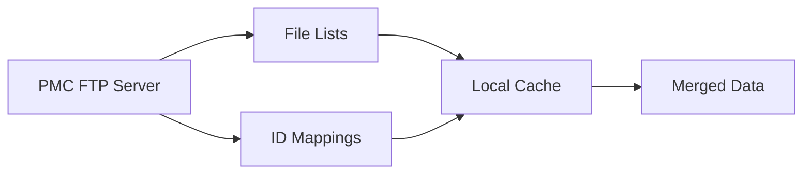

# PubMed Central Integration

Comprehensive integration with PubMed Central (PMC) for automated discovery, download, and processing of biomedical literature. This module provides robust API clients, data fetchers, and processing utilities specifically designed for hepatoblastoma research and extensible to other biomedical domains.

## Overview

The PMC integration module handles the complete workflow from article discovery to full-text processing:

- **API Integration**: Robust PMC E-utilities API client with rate limiting
- **Search Management**: Configurable search terms for targeted literature discovery
- **Data Fetching**: Efficient download of article metadata and full-text content
- **Format Support**: Handles both PDF and NXML document formats
- **Quality Assurance**: Validation, error handling, and retry mechanisms

## Module Architecture

```
sources/pubmed_pmc/
├── fetch/                      # Data fetching utilities
│   ├── base_fetcher.py        # Base class for all fetchers
│   ├── fetch_file_list.py     # PMC file list fetcher
│   ├── fetch_PMCID_mapping.py # ID mapping fetcher
│   └── fetch_xml_paths.py     # Article path resolver
├── data/                       # Downloaded reference data
├── temp/                       # Temporary processing files
├── fetch_abstracts.py          # Abstract fetching utility
├── merge_article_paths_with_pmids.py  # Data merging logic
├── pmc_api_client.py          # Core API client
├── search_terms.json          # Search configuration
└── README.md                   # This file
```

## Core Components

### Search and Discovery (`pmc_api_client.py`, `search_terms.json`)
- **Targeted Search**: Hepatoblastoma-specific search terms and filters
- **API Integration**: E-utilities API client with proper rate limiting
- **Result Processing**: PMCID extraction and validation
- **Search Optimization**: Optimized queries for maximum relevant results

### Data Fetching (`fetch/`)
- **Reference Files**: Automated download of PMC file lists and ID mappings
- **Incremental Updates**: Only fetch new articles since last update
- **Path Resolution**: Map PMCIDs to downloadable file paths
- **Bulk Operations**: Efficient batch processing of large datasets

### Content Retrieval
- **Multi-format Support**: PDF and NXML document download
- **Archive Handling**: TAR.GZ extraction and content management
- **Error Recovery**: Robust download with retry mechanisms
- **Content Validation**: Verify downloaded content integrity

## Search Configuration

### Hepatoblastoma-Focused Terms (`search_terms.json`)


### Search Strategy
- **Precision-Focused**: Balanced recall and precision for hepatoblastoma literature
- **Multi-Term Queries**: Combined terms for comprehensive coverage
- **Date Filtering**: Configurable publication date ranges
- **Journal Filtering**: Focus on high-impact biomedical journals

## Usage Examples

### Basic Article Discovery
```python
from BFHTW.sources.pubmed_pmc.pmc_api_client import PMCAPIClient

# Initialize API client
client = PMCAPIClient(
    search_terms_file_path="search_terms.json",
    db="pmc"
)

# Get PMCIDs for hepatoblastoma articles
pmcids = client.pmc_ids
print(f"Found {len(pmcids)} relevant articles")
```

### Fetch Reference Data
```python
from BFHTW.sources.pubmed_pmc.fetch.fetch_file_list import FileListFetcher
from BFHTW.sources.pubmed_pmc.fetch.fetch_PMCID_mapping import PMCIDMappingFetcher

# Get latest PMC file list
file_fetcher = FileListFetcher()
new_articles = file_fetcher.fetch_new_articles()

# Get PMCID to PMID mappings
mapping_fetcher = PMCIDMappingFetcher()
id_mappings = mapping_fetcher.fetch()
```

### Resolve Download Paths
```python
from BFHTW.sources.pubmed_pmc.fetch.fetch_xml_paths import FetchXML

# Map PMCIDs to downloadable paths
xml_fetch = FetchXML()
article_paths = xml_fetch.match_pmcids_to_ftp_paths()

# Filter for articles with full text available
full_text_articles = article_paths[
    article_paths['File'].str.contains('.tar.gz')
]
```

### Download Full-Text Articles
```python
from BFHTW.utils.io.tarball_fetcher import TarballFetcher

# Download and extract article
fetcher = TarballFetcher(base_dir)
tarball_path = fetcher.download(full_url, target_path)
extracted_path = fetcher.extract(tarball_path, extract_to)
```

## Data Flow

### 1. Search and Discovery


### 2. Reference Data Management


### 3. Article Processing


## Performance Optimization

### API Rate Limiting
```python
# Built-in rate limiting for PMC API
class PMCAPIClient:
    def __init__(self):
        self.rate_limiter = RateLimiter(
            calls_per_second=3,  # PMC recommendation
            burst_limit=10
        )
```

### Caching Strategy
- **Reference Data**: Daily snapshots of PMC file lists
- **Search Results**: Cache search results for 24 hours
- **Download Queue**: Persistent queue for interrupted downloads
- **Content Cache**: Intelligent caching of processed articles

### Batch Processing
```python
# Efficient batch operations
batch_processor = BatchProcessor(
    batch_size=100,
    max_concurrent=5,
    retry_attempts=3
)

results = batch_processor.process_pmcids(
    pmcid_list=target_articles,
    include_abstracts=True,
    download_full_text=True
)
```

## Quality Assurance

### Data Validation
- **PMCID Format**: Validate PMC identifier format
- **Content Integrity**: Verify downloaded file checksums
- **Metadata Completeness**: Check required fields presence
- **Duplicate Detection**: Prevent duplicate article processing

### Error Handling
```python
from BFHTW.sources.pubmed_pmc.error_handling import PMCErrorHandler

handler = PMCErrorHandler(logger=logger)

try:
    download_article(pmcid)
except PMCNotAvailableError:
    handler.handle_unavailable_article(pmcid)
except NetworkError as e:
    handler.handle_network_error(e, retry=True)
except Exception as e:
    handler.handle_unexpected_error(e, pmcid)
```

## Integration with BFHTW Pipeline

### Automatic Discovery
The PMC integration seamlessly feeds into the main processing pipeline:

1. **Daily Updates**: Automated discovery of new hepatoblastoma articles
2. **Queue Management**: Intelligent prioritization of articles for processing
3. **Format Handling**: Automatic routing based on PDF/NXML format
4. **Metadata Extraction**: Structured metadata for database storage

### Configuration Management


## Monitoring and Analytics

### Processing Metrics
- **Discovery Rate**: Articles found per search execution
- **Download Success**: Success/failure rates for content retrieval
- **Processing Time**: Average time per article processing
- **Storage Efficiency**: Compression and deduplication statistics

### Quality Metrics
- **Relevance Score**: Automated relevance assessment for discovered articles
- **Content Quality**: Text extraction quality and completeness
- **Metadata Accuracy**: Validation against PMC source data
- **Coverage Analysis**: Gap analysis in hepatoblastoma literature coverage

---

*Optimized for hepatoblastoma research with robust error handling and comprehensive quality assurance for reliable biomedical literature processing.*